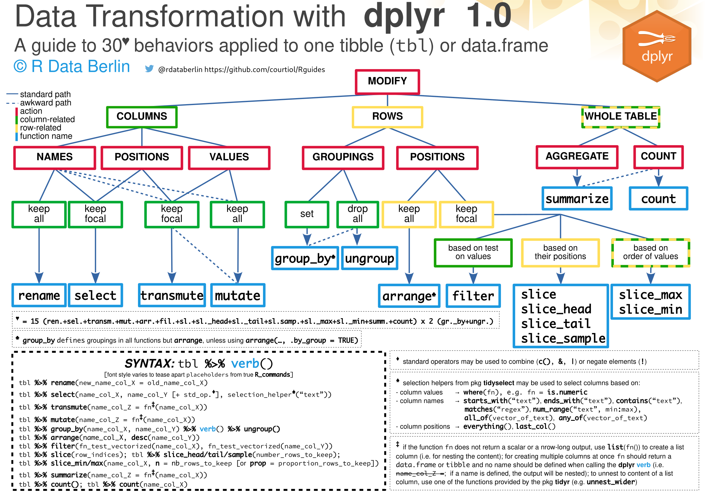

# Data transformation with ``dplyr::``

I have created this alternative cheat sheet (or guide) for those who already know a little about __dplyr__. The point of this cheat is to help you figuring out quickly which verb, suffix and arguments to use -- in the context of data transformation applied to a single table of class ``tibble`` or ``data.frame``.

As such the sheet complements and does not substitute the official __dplyr__ cheat sheet which is available [here](https://github.com/rstudio/cheatsheets).

Note that many __dplyr__ functions are not covered here; all the nice joining functions designed to work with pairs of tables, but also many others.

You should use the __PDF__ version of the cheat sheet for optimal quality and compatibility!

This sheet about __dplyr__ has been created end of September 2019 using LibreOffice with the type faces _monaco_ for ``code``, _Nimbus Sans_ for the main text & _Source Sans Pro Light_ for the title. I tested most thing on __dplyr__ version 0.8.3.

## Feedback wanted

If you have any ideas about how to improve this sheet, please file comments as issues or PR.

## Help wanted

Volunters who could turn this into a durable __LaTeX__ file are highly welcome (LibreOffice formating is too fragile for my taste, but the amount of __TikZ__ gymnastic required is a little daunting).

