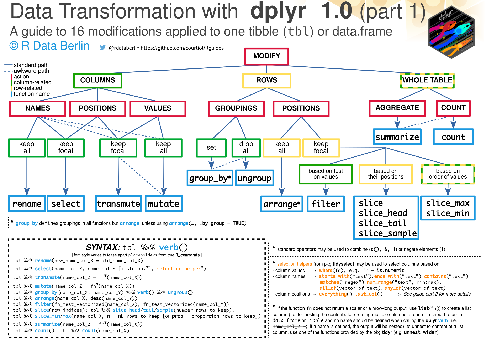
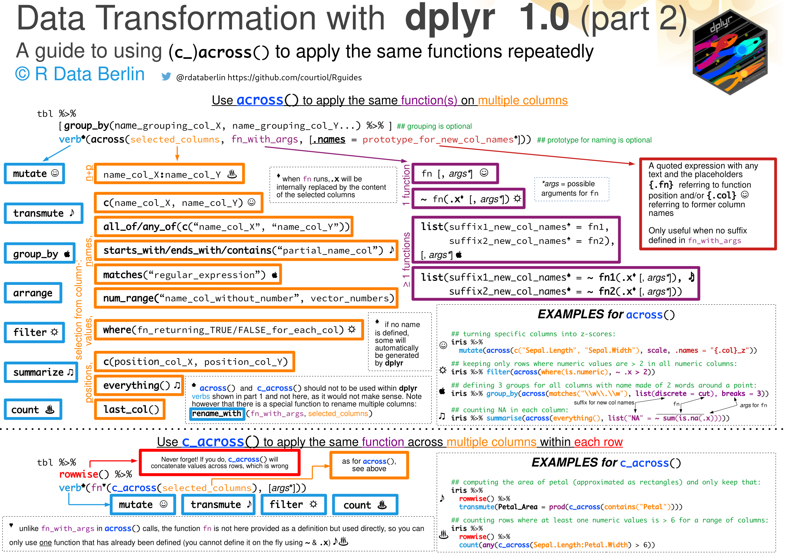

# Data transformation with ``dplyr`` 1.0

We have created these alternative cheat sheets (or guides) for those who already know a little about __dplyr__. The point of these guides is to help you figuring out quickly which verb and arguments to use -- in the context of data transformation applied to table(s) of class ``tibble`` or ``data.frame``.

As such the guides complement and do not substitute the official __dplyr__ cheat sheet which is available [here](https://github.com/rstudio/cheatsheets).

Note that many __dplyr__ functions are not covered here; all the nice joining functions designed to work with pairs of tables, but also many others.

These guides about __dplyr__ have been created on the October 2020 using LibreOffice. We tested most things on __dplyr__ version 1.0.1. The __PDF__ have directly been created using LibreOffice export function. The __PNG__ have been created importing the __PDF__ files in __GIMP__ at a resolution of 200 pixel per inch.

We used the following typefaces:
- Nimbus Sans
- monaco
- Source Code Pro
- Cantarell

## Feedback wanted

If you have any ideas about how to improve these guides, please leave comments as issues or PR.

## Help wanted

Volunters who could turn these guides into durable __LaTeX__ files are highly welcome (LibreOffice formating is too fragile, but the amount of __TikZ__ gymnastic required is a little daunting).
